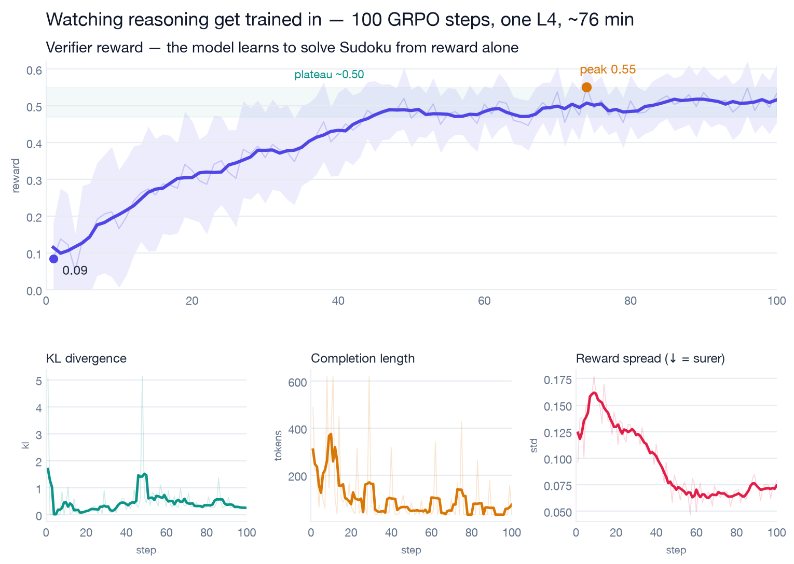
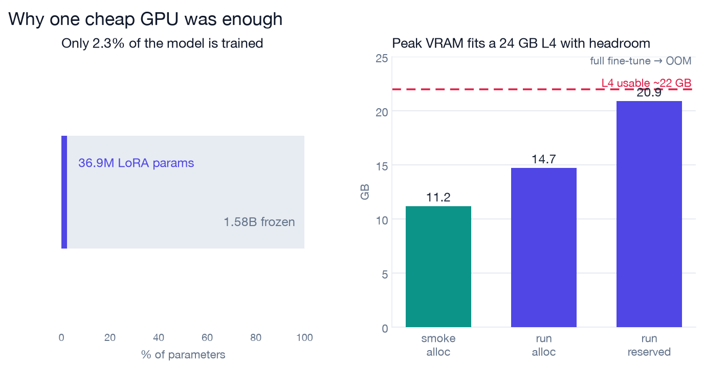
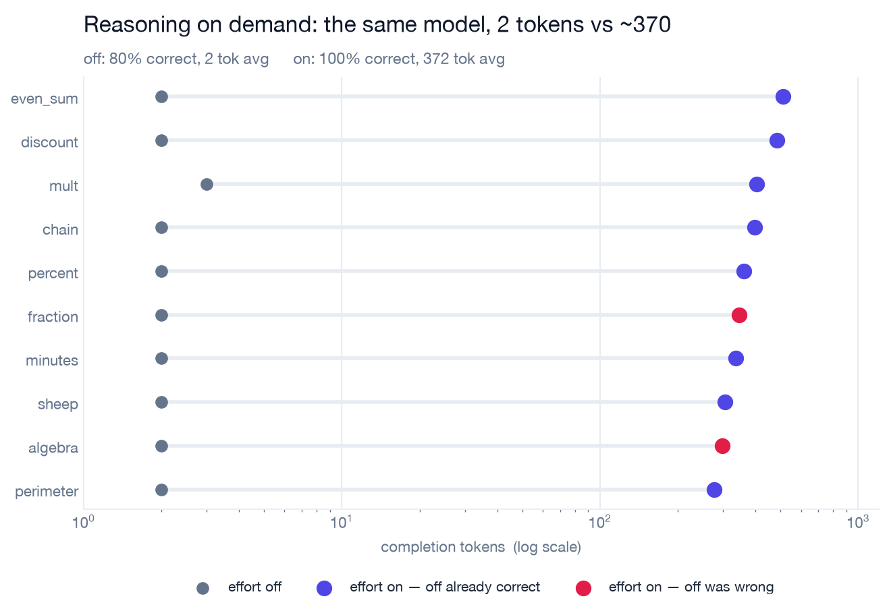
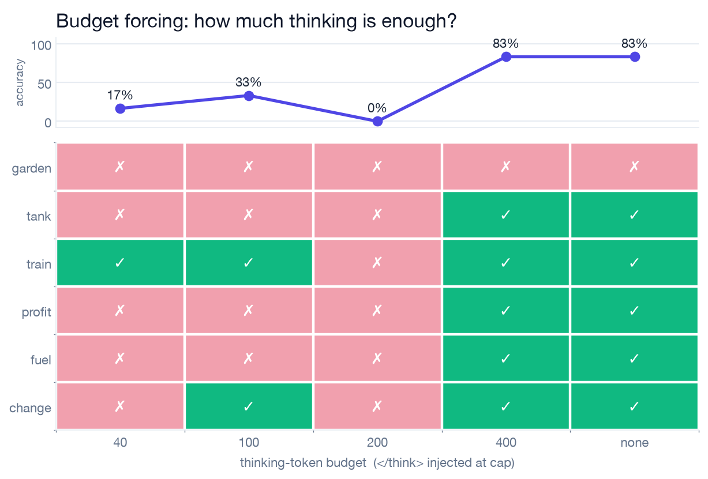
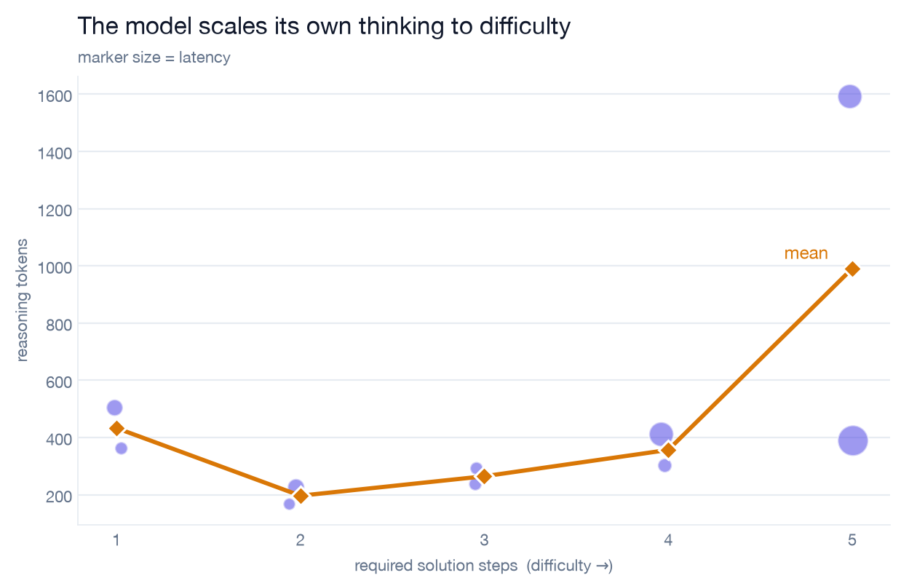
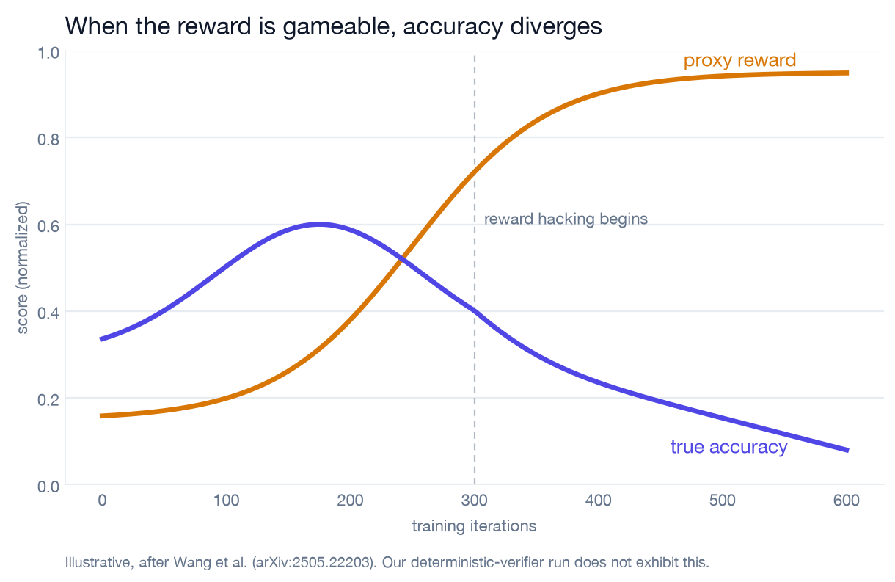
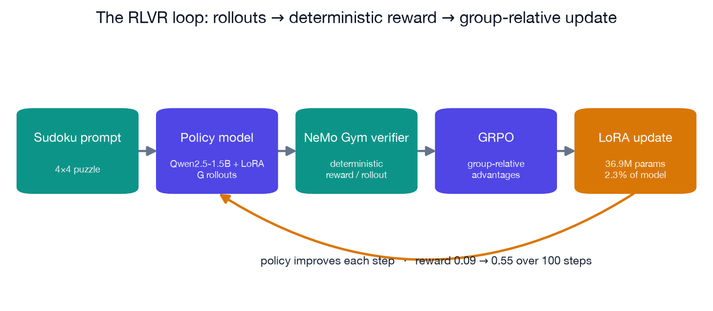

# Reasoning Is a Setting, Not a Trait

**Training a 1.5B model to reason from scratch with RLVR — then metering every token of thinking at inference.**

A hands-on project that makes reasoning effort concrete: train it in with $2 of GPU time, then show it can be switched, capped, and self-regulated at inference. Every chart below is built from my own run data.

→ **[Read the full blog post](blog/rlvr-reasoning-effort.md)**

---

## What's in here

| Path | What it is |
|------|------------|
| `src/train/modal_grpo.py` | GRPO training on Modal L4 (Unsloth + TRL + NeMo Gym verifier) |
| `src/demos/effort_modes.py` | Effort toggle sweep — same model, same questions, one system-prompt knob |
| `src/demos/budget_forcing.py` | Hard token budget injection via `</think>` marker (own decode loop) |
| `src/demos/adaptive_compute.py` | Difficulty ladder — does the model self-allocate compute? |
| `src/viz/make_charts.py` | Generates all 7 editorial figures from captured data |
| `data/metrics/` | WandB telemetry (101 rows), Modal VRAM snapshots |
| `data/phase3/` | Raw CSVs from each inference experiment |
| `blog/` | Final blog post + all 7 figures |

---

## The training run

**Model:** Qwen2.5-1.5B-Instruct · **Adapter:** LoRA r=32 (2.3% of params, 36.9M) · **Task:** 4×4 mini-Sudoku · **Reward:** deterministic NeMo Gym verifier · **Algorithm:** GRPO · **Platform:** Modal L4 24GB · **Cost:** ~$2 · **Time:** 76 min

Reward climbed **0.09 → 0.55** over 100 steps. The model was never shown a single solution — it discovered structure through trial and reward alone.

*Top: reward curve. Secondary panels: KL divergence stays bounded, completion length drops as the model gets more precise, reward spread narrows as it gets more confident.*

*Peak VRAM: 14.7 GB allocated / 20.9 GB reserved — fits a 24 GB L4 with room to spare. Full fine-tuning OOMs before step 1.*

---

## Inference experiments

All three run against `nvidia/llama-3.3-nemotron-super-49b-v1` (Experiments 1 & 3) and `DeepSeek-R1-Distill-Qwen-1.5B` (Experiment 2, local decode loop).

### 1 — The effort switch

Same model, same weights, one line of config. "Off" answers in 2 tokens on average; "on" spends 372. On easy problems the answers are identical. On harder ones, "off" drops to 80% while "on" holds 100%.

*Each row is a problem. Gray = reasoning off (2 tokens). Indigo/rose = reasoning on. Red dots = the two problems where thinking changed the answer from wrong to right. The x-axis is log-scaled.*

---

### 2 — A hard token budget

Inject the end-of-thinking marker at a fixed token cap, force an answer immediately. Sweeping the cap reveals a **compute floor**: below ~400 tokens accuracy collapses, at 400 it recovers, and removing the cap does no better.

*Green = correct, rose = wrong. The 200-token column is all red — truncating mid-reasoning is worse than no reasoning at all. The hardest problem (`garden`) never solves at any budget tested.*

---

### 3 — The model sets its own budget

Left uncapped, a capable reasoning model already scales effort to difficulty. A graded ladder from 1-step to 5-step problems shows reasoning tokens climb from ~200 to ~1000.

*X-axis = number of sequential solution steps required (objective difficulty). The model doesn't know a problem is easy until it thinks about it — hence the occasional long trace on simple inputs.*

---

## The failure mode: reward hacking

Use a proxy reward (format bonus, length reward, learned scorer) instead of a deterministic verifier, and optimization finds the gap between the proxy and the truth. Reward climbs; real accuracy falls.

*Illustrative, after [Wang et al., arXiv:2505.22203](https://arxiv.org/abs/2505.22203). My deterministic-verifier run does not exhibit hacking — which is the point.*

---

## Architecture

---

## Stack

| Layer | Tool |
|-------|------|
| Training | [Unsloth](https://github.com/unslothai/unsloth) + [TRL GRPOTrainer](https://huggingface.co/docs/trl) |
| Reward | [NVIDIA NeMo Gym](https://github.com/NVIDIA/NeMo-Gym) deterministic Sudoku verifier |
| Cloud GPU | [Modal](https://modal.com) (L4 24GB, `@app.function(gpu="L4")`) |
| Experiment tracking | [Weights & Biases](https://wandb.ai) — run `ll9j3my7`, project `rlvr-sudoku` |
| Adapter storage | [Hugging Face Hub](https://huggingface.co/Samanthkoduru/rlvr-sudoku-grpo) |
| Inference (hosted) | NVIDIA Build API — `nvidia/llama-3.3-nemotron-super-49b-v1` |
| Inference (local) | `DeepSeek-R1-Distill-Qwen-1.5B` (budget forcing, own decode loop) |
| Visualization | matplotlib, CVD-safe indigo/teal/amber/rose palette |

---

## Key results at a glance

| Experiment | Key number |
|------------|-----------|
| Training reward gain | 0.09 → 0.55 (6×) over 100 steps |
| Peak VRAM | 14.7 GB allocated on a 24 GB L4 |
| Effort off vs on | 2 tokens vs 372 tokens — 186× difference, same answer on easy problems |
| Budget forcing floor | <400 tokens → 0–33% accuracy; ≥400 → 83% |
| Adaptive compute range | ~200 tokens (1-step) → ~1000 tokens (5-step) |
| Total GPU cost | ~$2 |

---

## References

- GRPO: DeepSeekMath ([arXiv:2402.03300](https://arxiv.org/abs/2402.03300))
- Budget forcing: s1 ([arXiv:2501.19393](https://arxiv.org/abs/2501.19393))
- Reward hacking: [arXiv:2505.22203](https://arxiv.org/abs/2505.22203)
